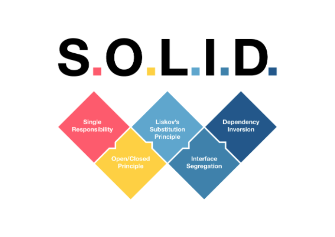

# SOLID-in-Apex

SOLID - combines 5 design principle of Object-Oriented programming. The purpose of these to make software designs more understandable, flexible, and maintainable.

Don't get confuse with Design Patterns and Design Principles, both are different but they complements each other.

Here will try to learn SOLID design principle while implementing it in Apex.

